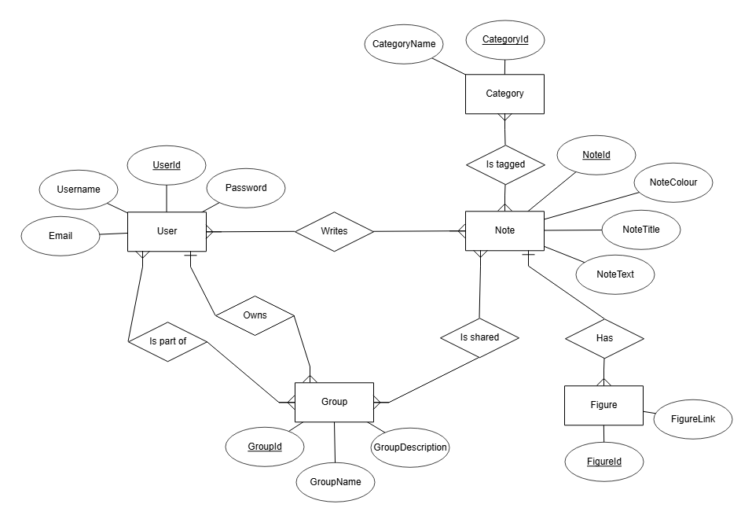

# Minimal Notepad (Backend)
<p align="center">
  
</p>

Minimal Notepad is a JavaFX and Spring Boot-based desktop application designed to take, organize and share notes. It is built for students, teachers, and professionals and provides a user-friendly interface. With features like tagging, annotations, and collaboration, it enhances learning and teamwork and offers a seamless and efficient note-taking experience.

This project was created as part of SEP1 (Software Engineering Project 1) and SEP2 (Software Engineering Project 2) at Metropolia UAS. 

This is the backend part of the Minimal Notepad Application.

The frontend for this application is available at: [Frontend Repository](https://github.com/Minimal-Alexi/Minimal-Notepad-Client)

📆 January - May, 2025


## Features
- User authentication and authorization (JWT-based)
- Create, read, update, and delete (CRUD) notes and groups
- Secure API endpoints
- Lightweight and efficient backend
- Integration with the frontend

## Technical stack
- **Java 17** – Java version for development
- **Spring Boot** – Backend framework
- **MariaDB** – Database
- **Hibernate JPA** – ORM for database management
- **Docker** – Containerization
- **Jenkins** – CI/CD pipeline
- **dotenv** – Config management
- **JUnit 5** – Testing framework
- **MockMvc** – Web layer testing
- **JaCoCo** – Code coverage

## Project Structure

| **Folder/File**                           | **Purpose**                            | **Responsibilities**                                                                             |
|-------------------------------------------|----------------------------------------|--------------------------------------------------------------------------------------------------|
| `config/`                                 | Manages configuration settings         | Defines application-wide settings, manages beans, and integrates features.                       |
| `controller/`                             | Handles HTTP requests and responses    | Receives user input (GET, POST, PUT, DELETE), calls service methods, and returns responses.      |
| `dto/`                                    | Transfers data between layers          | Defines structured data, formats request/response, and prevents exposing entities directly.      |
| `exception/`                              | Manages custom exceptions and errors   | Defines and handles application-wide exceptions, providing meaningful error responses.           |
| `model/`                                  | Represents data structure (Entity/DTO) | Represents database tables and relationships, includes fields, getters, and setters.             |
| `repository/`                             | Handles database operations            | Provides CRUD operations and communicates with the database.                                     |
| `service/`                                | Implements business logic              | Contains core business logic, interacts with the repository, and serves the controller.          |
| `utils/`                                  | Provides reusable helper functions     | Contains static methods for common tasks (e.g., string formatting, date conversion).             |
| [`POSTMAN/`](./src/main/resources/POSTMAN)| Contains Postman collections           | Stores Postman collections for API testing and documentation.                                    |
| `Dockerfile`                              | Defines containerization setup         | Builds and configures the Docker image for the application.                                      |
| `Jenkinsfile`                             | Defines CI/CD pipeline                 | Configures continuous integration and delivery pipeline using Jenkins.                           |

## Developer's Guides
1. [Docker Setup Guide](./docs/Docker_Setup.md)  
   Instructions for setting up Docker and running the app in a containerized environment.

2. [Jenkins Setup Guide](./docs/Jenkins_Setup.md)  
   Instructions for configuring Jenkins for automated build and deployment.

## API Endpoints

### Users API
| **Method** | **Endpoint**                | **Description**                |
|-----------|------------------------------|--------------------------------|
| **GET**   | `/api/user/`                 | Get current user details       |
| **DELETE**| `/api/user/`                 | Delete user account            |
| **PUT**   | `/api/user/`                 | Update username & email        |
| **PUT**   | `/api/user/change-password`  | Change user password           |

### Authentication API
| **Method** | **Endpoint**                  | **Description**          |
|-----------|--------------------------------|--------------------------|
| **POST**  | `/api/users-authentication/login`  | Authenticate user and get JWT token |
| **POST**  | `/api/users-authentication/register` | Register a new user and get JWT token |

### Notes API
| **Method** | **Endpoint**                    | **Description**                           |
|-----------|---------------------------------|--------------------------------------------|
| **GET**   | `/api/note/`                    | Get all notes for the authenticated user.  |
| **GET**   | `/api/note/{noteId}`            | Get a specific note by its ID.             |
| **GET**   | `/api/note/my-groups`           | Get notes from groups the user belongs to. |
| **POST**  | `/api/note/`                    | Create a new note.                         |
| **PATCH** | `/api/note/{noteId}`            | Update an existing note.                   |
| **DELETE**| `/api/note/{noteId}`            | Delete a note by ID.                       |
| **POST**  | `/api/note/filter`              | Filter notes by category.                  |
| **POST**  | `/api/note/search`              | Search for notes using a query.            |

### Groups API
| **Method** | **Endpoint**                     | **Description**                         |
|-----------|----------------------------------|-----------------------------------------|
| **GET**   | `/api/groups/all`               | Get all groups.                        |
| **GET**   | `/api/groups/my-groups`         | Get groups the user belongs to.        |
| **GET**   | `/api/groups/available`         | Get groups the user can join.          |
| **GET**   | `/api/groups/{id}`              | Get a specific group by ID.            |
| **POST**  | `/api/groups`                   | Create a new group.                    |
| **PUT**   | `/api/groups/{id}`              | Update a group by ID.                  |
| **DELETE**| `/api/groups/{id}`              | Delete a group by ID.                  |
| **POST**  | `/api/groups/{groupId}/join`    | Join a group.                          |
| **DELETE**| `/api/groups/{groupId}/leave`   | Leave a group.                         |
| **DELETE**| `/api/groups/{groupId}/remove/{userId}` | Remove a user from a group. |

### Categories API
| **Method** | **Endpoint**            | **Description**              |
|-----------|------------------------|------------------------------|
| **GET**   | `/api/categories`      | Get all categories.         |
| **GET**   | `/api/categories/{id}` | Get a category by ID.       |
| **POST**  | `/api/categories`      | Create a new category.      |
| **PUT**   | `/api/categories/{id}` | Update a category by ID.    |
| **DELETE**| `/api/categories/{id}` | Delete a category by ID.    |

## How to Run Locally

### Pre-settings
Before running the application locally, make sure you have the following tools installed:

- **Java 17** (or newer) - [Install Java](https://adoptopenjdk.net/)
- **Docker** - [Install Docker](https://www.docker.com/get-started)
- **Jenkins** (optional, for CI/CD) - [Install Jenkins](https://www.jenkins.io/doc/book/installing/)
- **Postman** (optional, for API testing) - [Install Postman](https://www.postman.com/downloads/)
- **MariaDB** or any compatible database.

### Steps to Run Locally

1. Clone the repository
   ```sh
   git clone https://github.com/Minimal-Alexi/Minimal-Notepad.git
   cd Minimal-Notepad
   ```
2. Copy the .env.example file and create a new `.env` file in the same directory and add your database password inside .env
   ```sh
   cp .env.example .env
   ```
You can generate a secret key using [this link](https://jwtsecret.com/), the minimum key length should be at least 128 characters, but it is recommended to use 256 characters.

3. Execute the script from the `init-db.sql` file located in the db-init folder to create the database.

The script initializes the database with: 3 users, 3 groups, 4 notes and 3 categories.

4. Run the `MinimalnotepadApplication` file to start the application.

## Testing
1. Build the project:
   ```sh
   mvn clean install
   ```
2. Run tests:
   ```sh
   mvn test
   ```
3. Generate code coverage report:
   ```sh
   mvn jacoco:report
   ```
The project uses JaCoCo for code coverage analysis. After running the tests, you can view the coverage report in `target/site/jacoco/index.html`.

## UML Diagrams

Below is a picture of the ERD structure of our project, which is essential to our apps development.


Our project has UML Diagrams made, for the purpose of explaining the code infrastructure and the workflow. [By clicking this link](./docs/diagrams), you can find more detailed explanations of the diagrams.


## Additional Development Documentation
1. [Docker](./docs/Docker_Setup.md)
2. [Jenkins](./docs/Jenkins_Setup.md)


## Authors
- [Viktoriia Beloborodova](https://github.com/Viktoriia-code)
- [Alex Pop](https://github.com/Minimal-Alexi)
- [Trang Vu](https://github.com/cindy3377)
- [Trung Doan](https://github.com/viettrung2103)
