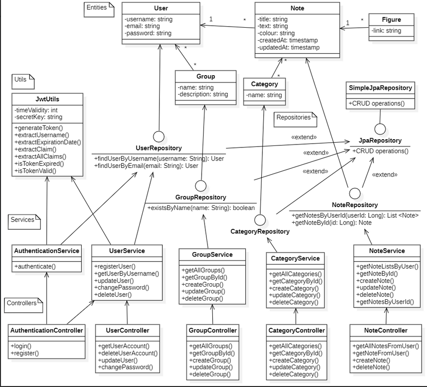

# Minimal Notepad Backend Class Diagram

## **Entities**
### **User**
- **Attributes**:
    - `username: string`
    - `email: string`
    - `password: string`
- **Relationships**:
    - One-to-many with `Note`
    - Many-to-many with `Group`

### **Group**
- **Attributes**:
    - `name: string`
    - `description: string`
- **Relationships**:
    - Many-to-many with `User`

### **Category**
- **Attributes**:
    - `name: string`
- **Relationships**:
    - One-to-many with `Note`

### **Note**
- **Attributes**:
    - `title: string`
    - `text: string`
    - `colour: string`
    - `createdAt: timestamp`
    - `updatedAt: timestamp`
- **Relationships**:
    - Many-to-one with `User`
    - Many-to-one with `Category`
    - One-to-many with `Figure`

### **Figure**
- **Attributes**:
    - `link: string`
- **Relationships**:
    - Many-to-one with `Note`

---

## **Repositories**
### **UserRepository**
- **Methods**:
    - `findUserByUsername(username: String): User`
    - `findUserByEmail(email: String): User`

### **GroupRepository**
- **Methods**:
    - `existsByName(name: String): boolean`

### **CategoryRepository**
- Extends `JpaRepository`

### **NoteRepository**
- **Methods**:
    - `getNotesByUserId(userId: Long): List<Note>`
    - `getNoteById(id: Long): Note`
- Extends `JpaRepository`

### **JpaRepository**
- Inherits `CRUD operations()`
- Extends `SimpleJpaRepository`

---

## **Services**
### **AuthenticationService**
- **Methods**:
    - `authenticate()`

### **UserService**
- **Methods**:
    - `registerUser()`
    - `getUserByUsername()`
    - `updateUser()`
    - `changePassword()`
    - `deleteUser()`

### **GroupService**
- **Methods**:
    - `getAllGroups()`
    - `getGroupById()`
    - `createGroup()`
    - `updateGroup()`
    - `deleteGroup()`

### **CategoryService**
- **Methods**:
    - `getAllCategories()`
    - `getCategoryById()`
    - `createCategory()`
    - `updateCategory()`
    - `deleteCategory()`

### **NoteService**
- **Methods**:
    - `getNoteListsByUser()`
    - `getNoteById()`
    - `createNote()`
    - `updateNote()`
    - `deleteNote()`
    - `getNotesByUserId()`

---

## **Controllers**
### **AuthenticationController**
- **Methods**:
    - `login()`
    - `register()`

### **UserController**
- **Methods**:
    - `getUserAccount()`
    - `deleteUserAccount()`
    - `updateUser()`
    - `changePassword()`

### **GroupController**
- **Methods**:
    - `getAllGroups()`
    - `getGroupById()`
    - `createGroup()`
    - `updateGroup()`
    - `deleteGroup()`

### **CategoryController**
- **Methods**:
    - `getAllCategories()`
    - `getCategoryById()`
    - `createCategory()`
    - `updateCategory()`
    - `deleteCategory()`

### **NoteController**
- **Methods**:
    - `getAllNotesFromUser()`
    - `getNoteById()`
    - `createNote()`
    - `updateNote()`
    - `deleteNote()`

---

## **Utils**
### **JwtUtils**
- **Attributes**:
    - `timeValidity: int`
    - `secretKey: string`
- **Methods**:
    - `generateToken()`
    - `extractUsername()`
    - `extractExpirationDate()`
    - `extractClaim()`
    - `extractAllClaims()`
    - `isTokenExpired()`
    - `isTokenValid()`

---

## **Summary**
Minimal notepads API manages:
- **Users**, **Groups**, **Categories**, and **Notes**.
- **Repositories** for data access using JPA.
- **Services** for handling business logic.
- **Controllers** for exposing RESTful APIs.
- **Authentication mechanisms** using JWT.

The system supports **user authentication**, **CRUD operations**, and **note categorization**.
