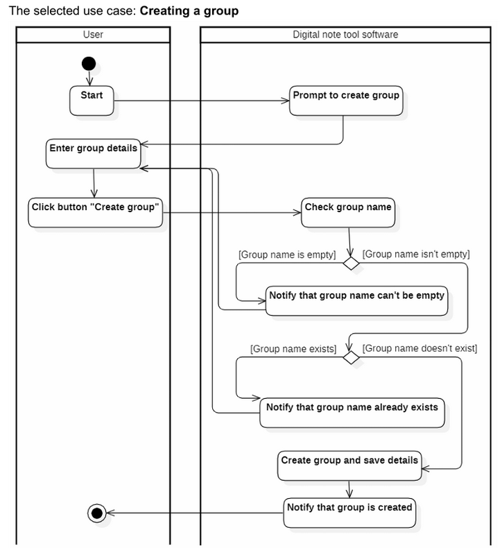

# Sequence Diagram: Creating a Group

This sequence diagram illustrates the process of creating a group in Minimal Notepad, including user interactions, system validations, and possible outcomes.

## **Actors & Components**
1. **User** – The person creating the group.
2. **Digital Note Tool Software** – The system that manages group creation, validation, and notifications.

---

## **Main Flow (Successful Group Creation)**
1. **User action:** The user starts the process.
2. **Prompt to create group:** The system prompts the user to enter group details.
3. **User enters group details** and clicks the "Create group" button.
4. **System checks group name** to ensure it is valid.
5. **If the group name is valid and does not exist:**
    - The system creates the group and saves the details.
    - The system notifies the user that the group is created.
6. **Process ends successfully.**

---

## **Alternative Flows**
### **1. Empty Group Name**
- If the group name is empty, the system notifies the user that the group name cannot be empty.
- The user must enter a valid group name to proceed.

### **2. Group Name Already Exists**
- If the group name already exists, the system notifies the user.
- The user must choose a different name to proceed.

---