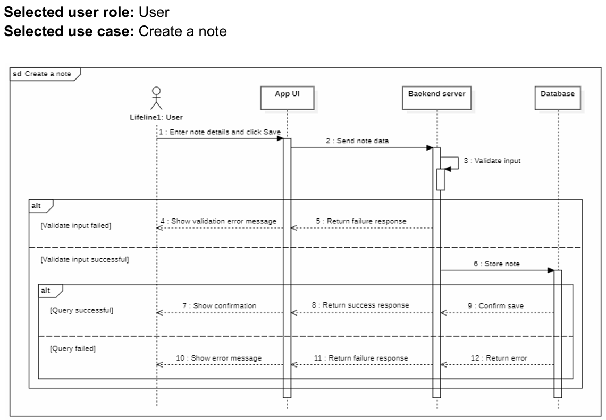

# Minimal Notepad Note Creation Sequence

This sequence diagram illustrates the process of creating a note, including user interactions, system validations, and possible outcomes.

## **Actors & Components**
1. **User** – The person creating the note.
2. **App UI** – The front-end interface where the user interacts.
3. **Backend Server** – The server handling business logic and database interactions.
4. **Database** – The storage system where notes are saved.

---

## **Main Flow (Successful Note Creation)**
1. **User action:** The user enters note details and clicks "Save."
2. **App UI sends data:** The UI forwards the note data to the backend server.
3. **Backend validation:** The backend server validates the input.
    - If validation fails, an error message is returned.
    - If validation succeeds, the process continues.
4. **Storing the note:** The backend server stores the note in the database.
5. **Database confirms save:** The database confirms that the note has been saved.
6. **Backend returns success response:** The backend acknowledges successful storage.
7. **App UI shows confirmation:** The UI notifies the user that the note has been saved.

---

## **Alternative Flows**
### **1. Validation Failure**
- If the input is invalid, the backend returns a failure response.
- The UI displays a validation error message to the user.

### **2. Database Query Failure**
- If storing the note fails, the database returns an error.
- The backend forwards this error to the UI.
- The UI displays an error message to the user.