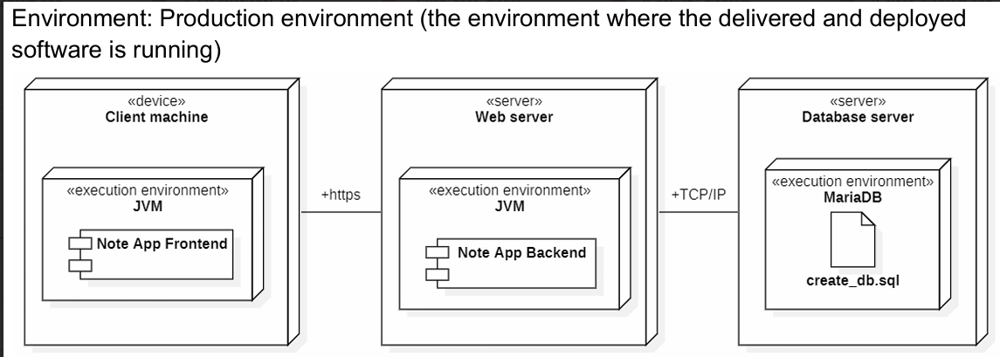

# Minimal Notepad Prod Environment

This diagram represents the **production environment** where the delivered and deployed software is running. The system consists of three main components:

## **1. Client Machine**
- **Type**: `device`
- **Execution Environment**: `JVM`
- **Software Component**: `Note App Frontend`
- **Communication Protocol**: `HTTPS` (to Web Server)

## **2. Web Server**
- **Type**: `server`
- **Execution Environment**: `JVM`
- **Software Component**: `Note App Backend`
- **Communication Protocol**:
    - `HTTPS` (from Client Machine)
    - `TCP/IP` (to Database Server)

## **3. Database Server**
- **Type**: `server`
- **Execution Environment**: `MariaDB`
- **Database Initialization File**: `create_db.sql`
- **Communication Protocol**: `TCP/IP` (from Web Server)

## **Summary**
This production environment setup ensures:
- **Separation of concerns**: Frontend, Backend, and Database are hosted on separate machines.
- **Secure communication**: HTTPS is used for client-to-server interaction.
- **Database management**: MariaDB is used for data storage, initialized with `create_db.sql`.

This architecture provides a **scalable**, **secure**, and **structured** deployment model for the **Minimal Notepad App.**.
