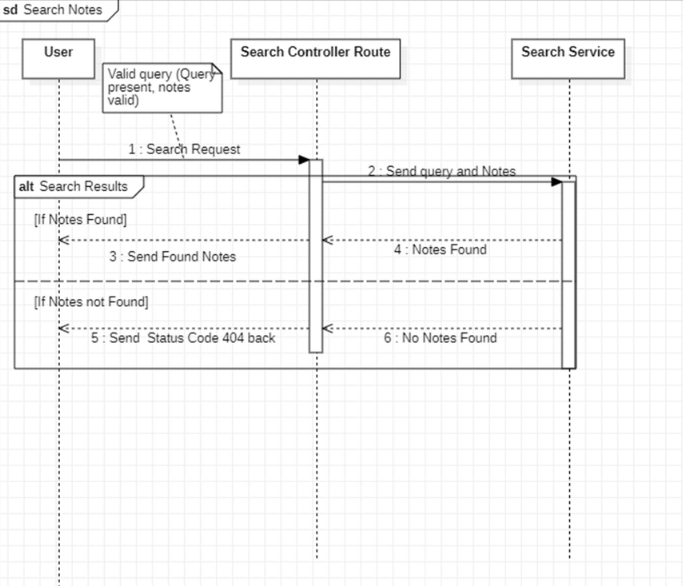

# Search Notes Sequence Diagram

This sequence diagram represents the interaction between the **User**, **Search Controller Route**, and **Search Service** during a search request.

## **Actors & Components**
1. **User** – The person initiating the search request.
2. **Search Controller Route** – The intermediary that processes the user's request and interacts with the search service.
3. **Search Service** – The backend system responsible for searching notes.

---

## **Main Flow (Successful Search with Results)**
1. **User submits a valid search request.**
2. **Search Controller Route forwards the query** to the Search Service.
3. **Search Service processes the query** and finds relevant notes.
4. **Search Service returns found notes** to the Search Controller Route.
5. **Search Controller Route sends the found notes back** to the User.

---

## **Alternative Flows**
### **1. No Matching Notes Found**
- The Search Service does not find any relevant notes.
- It returns a "No Notes Found" response to the Search Controller Route.
- The Search Controller Route sends an **HTTP 404 status code** back to the User, indicating no results were found.

---