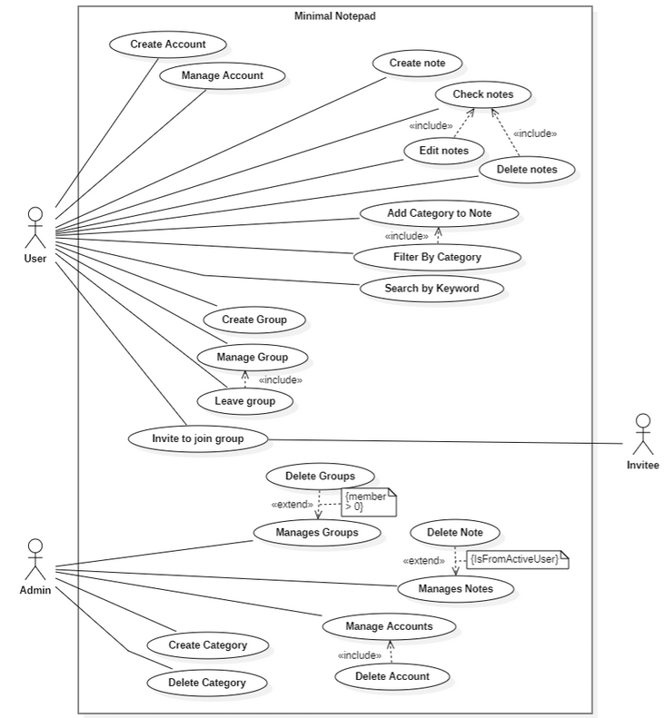

# Minimal Notepad Use Cases
Minimal Notepad is a note-taking application designed so that the users can have an easy time sharing notes together.

## Actors
1. User (Regular User)
2. Admin (Administrator)
3. Invitee (A person invited to join a group)

## Use Cases
Below is a description of all the use cases that our application will have.

### User Functionalities
    Account Management
        Create Account
        Manage Account

    Note Management
        Create Note
        Check Notes
            Includes:
                Edit Notes
                Delete Notes
        Add Category to Note (Includes "Filter by Category")
        Search by Keyword

    Group Management
        Create Group
        Manage Group (Includes "Leave Group")
        Invite to Join Group

### Admin Functionalities:

    Group Management
        Manages Groups
            Extends "Delete Groups" (with a condition: member count = 0)

    Note Management
        Manages Notes
            Extends "Delete Note" (with a condition: Is from Active User)

    Account Management
        Manage Accounts (Includes "Delete Account")

    Category Management
        Create Category
        Delete Category

### Invitee Functionalities:

    Can be invited to join a group but does not have any direct actions in the system.